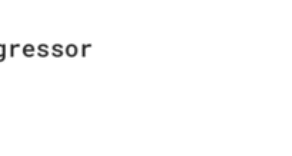

# Sklearn实战线性回归（9）
## 重点：
### 模型编译处的loss函数的定义
### 创建模型处最后的输出只有一个神经元 
### wide and deep 模型使用函数式API

## 1-导入依赖

```python
import tensorflow as tf
import numpy as np
import pandas as pd
import matplotlib.pyplot as plt
import os
import sys
from tensorflow import keras
import sklearn
import time
import matplotlib as mpl 
 ```
 ## 2-加载数据

 ```python
# 导入fetch_california_housing类
from sklearn.datasets import fetch_california_housing 
# 实例化对象
housing = fetch_california_housing()
# 打印相关信息
print(housing.DESCR)
print(housing.data.shape)
# 输出：(20640, 8)
print(housing.target.shape)
# 输出：(20640,)
 ```

 
 ```
#   print(housing.DESCR)的输出：
#  :Attribute Information:
#         - MedInc        median income in block
#         - HouseAge      median house age in block
#         - AveRooms      average number of rooms
#         - AveBedrms     average number of bedrooms
#         - Population    block population
#         - AveOccup      average house occupancy
#         - Latitude      house block latitude
#         - Longitude     house block longitude
 ```

### 3-使用pprint展示数据

 ```python
# 导入pprint（为了使展示更加好看）
import pprint
pprint.pprint(housing.data[:5])
pprint.pprint(housing.target[:5])
```

### 输出：


## 4-1数据预处理（划分训练集，测试集）

 ```python

from sklearn.model_selection import train_test_split

#拆分训练集，测试集
x_train_all,x_test,y_train_all,y_test = train_test_split(
             housing.data , housing.target , random_state=7,test_size = 0.2)

# 拆分训练集，验证集
x_train,x_valid,y_train,y_valid = train_test_split(
                x_train_all , y_train_all , random_state=11)

"""
train_test_split类里面传入housing.data-(20640, 8),
                  housing.targget-(20640,)
                           随机种子-random.state

(train_test_split 默认划分比例是3：1 
也可以通过test_size,改变比例,
默认test_size = 0.25)                    
```
## 4-2打印划分结果
 ```python
print(x_train.shape,y_train.shape)
print(x_valid.shape,y_valid.shape)
print(x_test.shape,y_test.shape)

"""
结果如下：
(12384, 8) (12384,)
(4128, 8) (4128,)
(4128, 8) (4128,)
"""
 ```
## 4-3数据标准化

 ```python
 #导入StandardScaler类
from sklearn.preprocessing import StandardScaler
# 实例化
scaler = StandardScaler()
# 调用scaler。fit 或者scaler.transform方法
x_train_scaled = scaler.fit_transform(x_train)
x_valid_scaled = scaler.transform(x_valid)
x_test_scaled = scaler.transform(x_test)
 ```

# 5-创建模型(核心模块)


 ```python
# 函数式API 或者说功能API 重点来了
# 像函数一样定义model 里面的每一层
# 1.deep模型的输入层 使用keras.layers.Input（）
input = keras.layers.Input(x_train.shape[1:])
# 2.定义deep模型的隐藏层
hidden1 = keras.layers.Dense(30,activation = 'relu')(input)
hidden2 = keras.layers.Dense(30,activation = 'relu')(hidden1)
# 假设wide模型与deep模型的输入是一样的
# 将wide模型的输入与deep模型的输出拼接起来，然后传到输出层
conect = keras.layers.concatenate([input,hidden2])
output = keras.layers.Dense(1)(conect)

# 最后固化模型
model = keras.models.Model(inputs=[input],outputs=[output])

# x_train.shape[1:]  tesult is (8,)
model.summary()
 ```

 ## 6-编译模型/定义callbacks/训练模型

  ```python
model.compile(loss="mean_squared_error",optimizer="sgd")
## 这里loss是关键  
callbacks=[keras.callbacks.EarlyStopping(patience = 5, min_delta = 1e-3)]
  history = model.fit(x_train_scaled,y_train,
                   validation_data= (x_valid_scaled,y_valid),
                   epochs = 100,callbacks = callbacks)
   ```


 [EarlyStopping 介绍（链接）](https://blog.csdn.net/zwqjoy/article/details/86677030)

 patient 代表了连续几个周期准确率没有增加或者增加很少就停止训练
 min_delta：增大或减小的阈值，只有大于这个部分才算作improvement。这个值的大小取决于monitor，也反映了你的容忍程度。例如笔者的monitor是’acc’
 
  ## 7-绘图

  ```python
def plot_learning_carvse(history):
    pd.DataFrame(history.history).plot(figsize=(8,5))
    plt.grid(True)
    plt.gca().set_ylim(0,1)
    plt.show()

plot_learning_carvse(history)
```
### 输出：


## 8-预测：
```python
model.evaluate(x_test,y_test)
```

